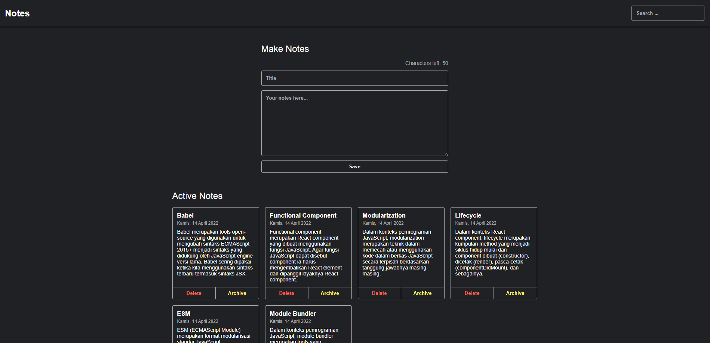

# Contact App



Aplikasi Tugas Akhir Dicoding Belajar Membuat Aplikasi Web dengan React

## Fitur-Fitur

Aplikasi Kontak dilengkapi dengan fitur-fitur berikut:

1. **Tambah Kontak**
3. **Hapus Kontak**
4. **Cari Kontak**
5. **Arsip Kontak**

## Instalasi

Untuk menjalankan Aplikasi Kontak secara lokal di komputer Anda, ikuti langkah-langkah berikut:

1. **Clone Repository**: Mulailah dengan _clone repository_ GitHub ini ke lokal Anda menggunakan perintah berikut:

   ```bash
   git clone https://github.com/username-anda/aplikasi-kontak.git
   ```
2. **Buka Direktori**: Pindah ke direktori proyek dengan menggunakan:
   ```bash
   cd aplikasi-kontak
   ```
   
3. **Instal Dependensi**: Pasang dependensi-dependensi yang diperlukan menggunakan pengelola paket seperti npm atau yarn. Jika Anda menggunakan npm, jalankan:
   ```bash
   npm install
   ```
   atau
   ```bash
   yawn install
   ```
   
4. **Jalankan Server Pengembangan**: Mulai server pengembangan dengan perintah berikut:
   ```bash
   npm run dev
   ```
